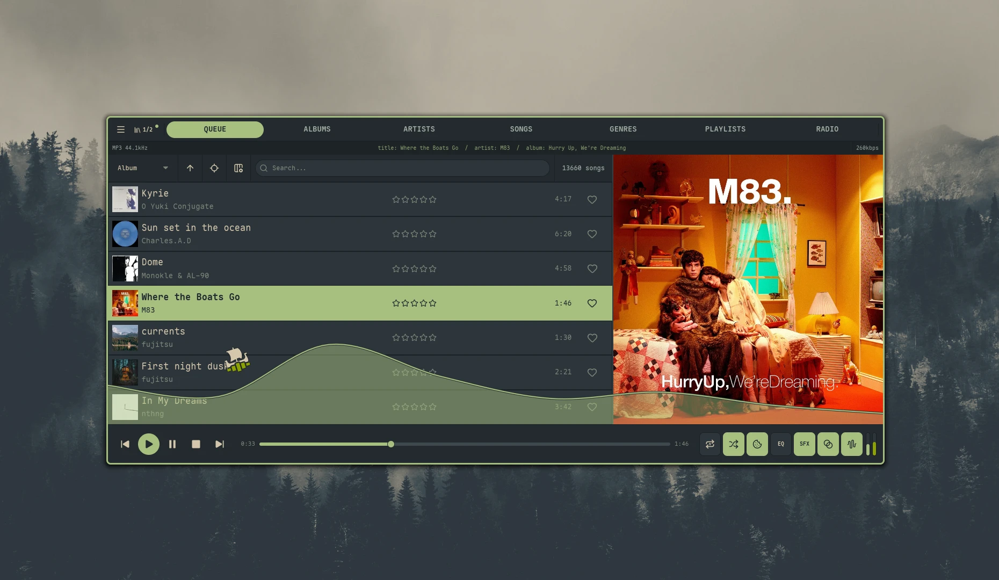
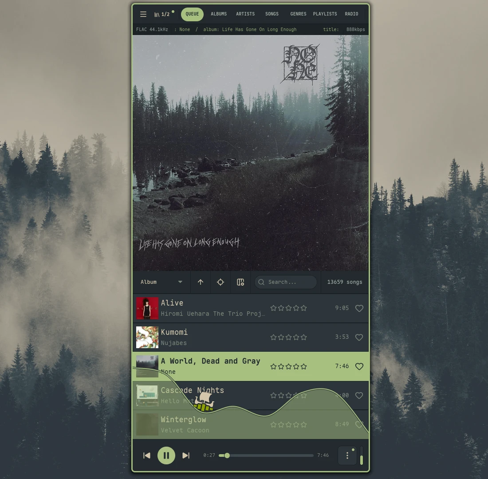

import { Tabs, TabItem } from '@astrojs/starlight/components';

Nokkvi uses a **server-only artwork pipeline** — images are fetched directly from Navidrome on demand and kept in an in-memory GPU texture cache. There is no local disk cache.

## How Artwork Works

When an album comes into view, Nokkvi fetches the image directly from your Navidrome server and decodes it into a GPU texture handle. Up to **512** album images are kept in memory at once (LRU eviction), so browsing a section of your library you visited recently has zero network overhead.

Thumbnails in list views are populated around the visible viewport — items well outside the visible area aren't pre-loaded.

## The Artwork Panel

The large artwork panel sits alongside most library views — Albums, Songs, Queue, Artists, Genres, and Playlists. It shows the cover for whichever row is centered, falling back to a 3×3 collage in Genres or Playlists when the focused item spans multiple albums.

How it sizes and whether it shows up is controlled by [`artwork_column_mode`](/reference/config/#artwork-column):

| Mode | Behavior |
| :--- | :------- |
| `auto` *(default)* | Size is derived from window dimensions — up to [`artwork_auto_max_pct`](/reference/config/#artwork-column) × window width, capped at 1000 px. Hides when the remaining slot-list width would drop below 800 px. On tall windows, artwork stacks vertically above the slot list instead — up to `artwork_auto_max_pct` × window height, capped at 1000 px; hides when fewer than 400 px of height would remain below it. |
| `always_native` | Always visible at a fixed fraction of window width. The image stays square and letterboxes vertically if the column is taller than wide. |
| `always_stretched` | Always visible at a fixed fraction of window width. The image fills the column non-square per [`artwork_column_stretch_fit`](/reference/config/#artwork-column) — `cover` crops to fit, `fill` distorts. |
| `always_vertical_native` | Always visible; artwork stacked above the slot list at a fixed fraction of window height. The image stays square, letterboxed horizontally as needed. |
| `always_vertical_stretched` | Always visible; artwork stacked above the slot list at a fixed fraction of window height. The image fills the rect per [`artwork_column_stretch_fit`](/reference/config/#artwork-column) — `cover` crops, `fill` distorts. |
| `never` | Column is always hidden. |

<Tabs syncKey="artwork-layout">
  <TabItem label="Horizontal">
    Artwork sits beside the slot list. Used by `always_native`, `always_stretched`, and `auto` on wide windows.

    
  </TabItem>
  <TabItem label="Vertical">
    Artwork stacks above the slot list. Used by `always_vertical_native`, `always_vertical_stretched`, and `auto` on tall windows.

    
  </TabItem>
</Tabs>

`always_native` and `always_stretched` show a drag handle between the artwork and the slot list — drag horizontally to resize; the new fraction is saved to [`artwork_column_width_pct`](/reference/config/#artwork-column) (clamped to 0.05–0.80). `always_vertical_native` and `always_vertical_stretched` show a drag handle below the artwork — drag vertically to resize; the new fraction is saved to [`artwork_vertical_height_pct`](/reference/config/#artwork-column) (clamped to 0.10–0.80). `auto` sizes itself, so there's no handle.

## Artwork Quality

The [`artwork_resolution`](/reference/config/#general-settings) setting controls the size requested for large panel artwork (the full-size view when an album is focused):

| Option | Requested Size |
| :----- | :------------- |
| [`default`](/reference/config/#general-settings) | 1000 px |
| [`high`](/reference/config/#general-settings) | 1500 px |
| [`ultra`](/reference/config/#general-settings) | 2000 px |
| [`original`](/reference/config/#general-settings) | Full resolution |

Thumbnails in list views always use a smaller size regardless of this setting.

## Navidrome Server Settings

Because Nokkvi no longer maintains its own disk cache, your Navidrome server does the heavy lifting of serving and resizing artwork. Two settings in `navidrome.toml` are worth tuning — both are documented in Navidrome's [available options reference](https://www.navidrome.org/docs/usage/configuration/options/#available-options):

### ImageCacheSize

The default `100MB` cache is too small for large libraries and will cause the server to re-process images on every fetch. Set it to at least `1500MB`:

```toml
ImageCacheSize = "1500MB"
```

### CoverArtQuality

Navidrome encodes artwork at quality `75` by default. The format depends on your setup: standalone binaries use JPEG, while Docker builds use WebP (native libwebp is bundled). Either way the quality value applies to both formats, and `75` is visibly lossy at the large panel sizes Nokkvi requests (up to 2000px):

```toml
CoverArtQuality = 90
```

If you want to explicitly control the format, Navidrome exposes `EnableWebPEncoding`. On non-Docker installs it defaults to `false` (JPEG/PNG); set it to `true` to opt in to WebP:

```toml
EnableWebPEncoding = true
```

## Updating Artwork

If you update a cover in Navidrome and want Nokkvi to reflect the change, right-click the artwork panel in the Albums, Songs, or Queue view and select **Refresh Artwork**. This evicts the cached image and fetches the latest version from the server.
