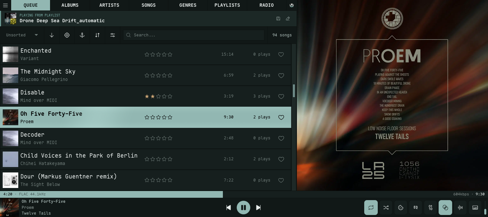
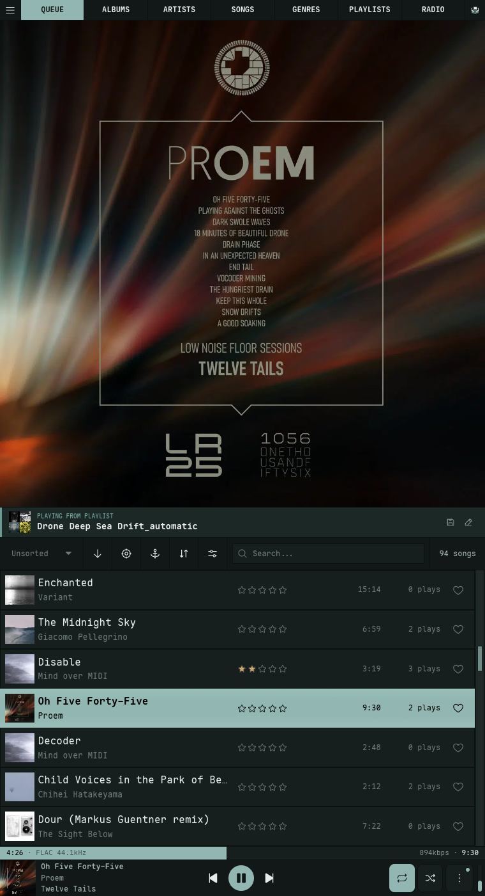

import { Tabs, TabItem } from '@astrojs/starlight/components';

Nokkvi uses a **server-only artwork pipeline** — images are fetched directly from Navidrome on demand and kept in an in-memory GPU texture cache. There is no local disk cache for browsing artwork. (The MPRIS integration writes a per-track `mpris-art-<pid>-<cover_id>_<hash>.jpg` (the previous one is removed on each song change, so it's ~one file at a time, plus a `mpris-art-<pid>-placeholder.jpg` written once per process) to `$XDG_CACHE_HOME/nokkvi/` so D-Bus clients can read the now-playing cover via `file://` without leaking your Subsonic credential — those are the only standalone artwork files Nokkvi writes. Remembered radio-station art is also kept on disk, but as bytes inside Nokkvi's local state database rather than a separate image file.)

## How Artwork Works

When an album comes into view, Nokkvi fetches the image directly from your Navidrome server and decodes it into a GPU texture handle. Two in-memory LRU caches keep recent images warm: a **thumbnail cache** holds up to **1024** slot-row thumbnails, and a **panel cache** holds up to **200** full-size images for the large artwork panel. Browsing a section of your library you visited recently has zero network overhead.

Thumbnails in list views are populated around the visible viewport — items well outside the visible area aren't pre-loaded.

### On Navidrome 0.64+

A 0.64 server describes each album, artist, and playlist cover alongside the row itself, which lets Nokkvi do three things it can't on older servers:

- **A thumbnail loads on its own color.** Instead of the flat `bg2` square, an empty slot takes the cover's **dominant color** while the image is in flight, so a list fills in on-palette rather than blinking grey. A loaded cover goes back to the `bg2` backdrop — square covers arrive padded with transparency, and a tint would bleed into their letterbox bars.
- **Art the server says is missing is never requested.** A cover Navidrome has settled doesn't exist anywhere gets no URL at all, so Nokkvi shows its own empty square instead of fetching the server's placeholder picture.
- **A replaced cover appears on its own.** Covers are versioned by the server's image **hash**, which changes exactly when the image bytes do — not on a play-count bump. Scroll the row back into view (or center it) and the new cover is there, in both the thumbnail and the large panel.

Older servers still work: they version covers by the entity's `updated_at` instead, tint nothing, and fall back to the manual [Refresh Artwork](#updating-artwork).

## The Artwork Panel

The large artwork panel sits alongside most library views — Albums, Songs, Queue, Artists, Genres, Playlists, Radios, and the Similar tab in the Library Browser (it also appears in the playlist editor). It shows the cover for whichever row is centered, falling back to a 3×3 collage in Genres or Playlists when the focused item spans multiple albums. On the Radios view it shows the [station's artwork](/guides/radio/#artwork).

A playlist's own cover can be set or reset from the [editor's edit-bar thumbnail](/guides/playlists/#the-cover) once the playlist has been saved.

<Tabs syncKey="artwork-layout">
  <TabItem label="Horizontal">
    Artwork sits beside the slot list. Used by `always_native`, `always_stretched`, and `auto` on wide windows.

    
  </TabItem>
  <TabItem label="Vertical">
    Artwork stacks above the slot list. Used by `always_vertical_native`, `always_vertical_stretched`, and `auto` on tall windows.

    
  </TabItem>
</Tabs>

How it sizes and whether it shows up is controlled by [`artwork_column_mode`](/reference/config/#artwork-column):

| Mode | Behavior |
| :--- | :------- |
| `auto` *(default)* | Size is derived from window dimensions — up to [`artwork_auto_max_pct`](/reference/config/#artwork-column) × window width, capped at 1000 px. Hides when the remaining slot-list width would drop below 800 px. On tall windows, artwork stacks vertically above the slot list instead — sized edge-to-edge to the window width (capped at 1000 px). Here `artwork_auto_max_pct` × window height acts as a threshold: the vertical panel only appears when that value is at least the window width (otherwise it would letterbox, so it stays hidden). It also hides when fewer than 400 px of height would remain below it. |
| `always_native` | Always visible at a fixed fraction of window width. The image stays square and letterboxes vertically if the column is taller than wide. |
| `always_stretched` | Always visible at a fixed fraction of window width. The image fills the column non-square per [`artwork_column_stretch_fit`](/reference/config/#artwork-column) — `cover` crops to fit, `fill` distorts. |
| `always_vertical_native` | Always visible; artwork stacked above the slot list at a fixed fraction of window height. The image stays square, letterboxed horizontally as needed. |
| `always_vertical_stretched` | Always visible; artwork stacked above the slot list at a fixed fraction of window height. The image fills the rect per [`artwork_column_stretch_fit`](/reference/config/#artwork-column) — `cover` crops, `fill` distorts. |
| `never` | Column is always hidden. |

`always_native` and `always_stretched` show a drag handle between the artwork and the slot list — drag horizontally to resize; the new fraction is saved to [`artwork_column_width_pct`](/reference/config/#artwork-column) (clamped to 0.05–0.80). `always_vertical_native` and `always_vertical_stretched` show a drag handle below the artwork — drag vertically to resize; the new fraction is saved to [`artwork_vertical_height_pct`](/reference/config/#artwork-column) (clamped to 0.10–0.80). `auto` sizes itself, so there's no handle.

## Artwork Quality

The [`artwork_resolution`](/reference/config/#general-settings) setting controls the size requested for large panel artwork (the full-size view when an album is focused):

| Option | Requested Size |
| :----- | :------------- |
| [`default`](/reference/config/#general-settings) | 1000 px |
| [`high`](/reference/config/#general-settings) | 1500 px |
| [`ultra`](/reference/config/#general-settings) | 2000 px |
| [`original`](/reference/config/#general-settings) | Full resolution |

Thumbnails in list views always use a smaller size regardless of this setting.

## Navidrome Server Settings

Because Nokkvi keeps no disk cache for browsing artwork, your Navidrome server does the heavy lifting of serving and resizing artwork. Nokkvi asks for every cover as a padded square, and with default settings Navidrome encodes square artwork as **lossless PNG**, so what you see is already full quality. The settings below in `navidrome.toml` are all documented in Navidrome's [available options reference](https://www.navidrome.org/docs/usage/configuration/options/#available-options):

### ImageCacheSize

Navidrome keeps each resized cover in an on-disk cache, keyed by image and size. A lossless PNG at the default 1000 px panel size is about a megabyte (up to ~3 MB for detailed covers), so the default `100MB` holds fewer than a hundred panel covers; after that, the server decodes and resizes a cover again every time it's evicted. Set it to at least `1500MB`:

```toml
ImageCacheSize = "1500MB"
```

### UICoverArtSize (optional)

Navidrome's artwork precache (on by default) resizes each cover ahead of time at `UICoverArtSize`, the size its own web UI requests (default `300`). Nokkvi never requests that size, so out of the box every cover is resized on first view. If you keep [`artwork_resolution`](/reference/config/#general-settings) at `default`, setting this to `1000` makes the precache produce exactly the panel image Nokkvi asks for:

```toml
UICoverArtSize = 1000
```

The tradeoff is that Navidrome's web UI then loads 1000 px covers too. The precache runs when Navidrome picks up a cover, so covers it already knows about stay cold until they're first viewed. The setting accepts 200–1200, so it can't match the `high` or `ultra` resolutions.

### EnableWebPEncoding

Leave this at its default of `false`. Turning it on makes Navidrome encode every resized cover as WebP at `CoverArtQuality` (default `75`), which replaces the lossless PNGs Nokkvi receives with lossy ones. The files get smaller, but covers lose detail.

`CoverArtQuality` itself has no effect on Nokkvi while `EnableWebPEncoding` is off, since PNG has no quality setting.

## Updating Artwork

If you update a cover in Navidrome and want Nokkvi to reflect the change, right-click the artwork panel in the Albums, Songs, or Queue view and select **Refresh Artwork**. This evicts the cached image and fetches the latest version from the server. On **Navidrome 0.64+** you rarely need it — a replaced cover [shows up by itself](#on-navidrome-064) the next time the row comes into view.

Radio stations work differently — right-click a station in the [Radios list](/guides/radio/#artwork) and choose **Refresh Artwork** to forget its remembered stream art and re-capture it.
