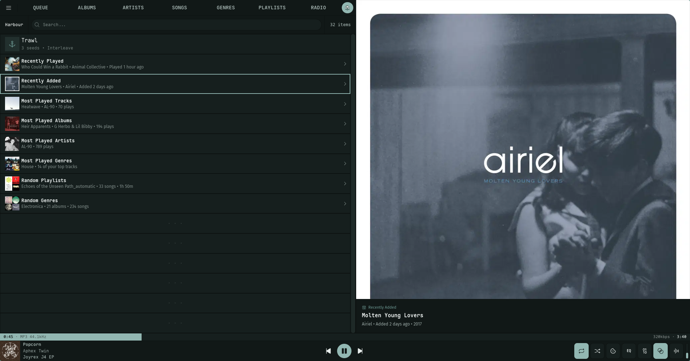
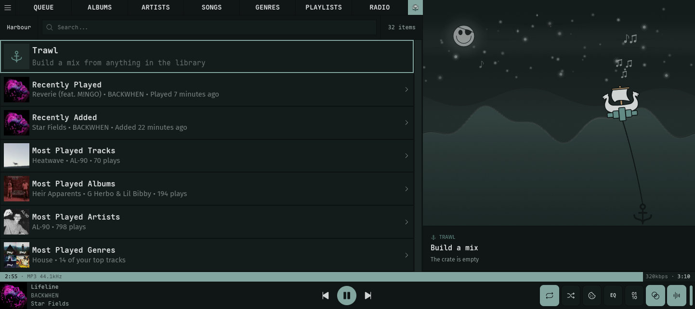

Harbour is Nokkvi's home view: a landing page of collapsible discovery shelves — recently played tracks, recently added albums, your most-played music, and a couple of random picks — with the app's first **whole-library search** living in the header. It's the one screen that reaches across everything at once, rather than browsing a single entity type.

## Getting to Harbour

Harbour isn't a numbered nav tab. Reach it any of these ways:

- The pinned **longship button** — on the far right of the top nav bar, or at the very bottom of the sidebar when [`nav_layout`](/reference/config/#interface-settings) is `side`.
- The `8` [hotkey](/reference/hotkeys/#views).
- `nokkvi switch-view harbour` from the [CLI](/guides/cli/#view-names).
- As your **start view** — set [`start_view`](/reference/config/#general-settings) to `Harbour` (Settings → General → **Start View**) to open here on launch. The default start view is still `Queue`.

## Discovery shelves

The body of Harbour is a stack of shelves, each capped at **four picks**:

| Shelf | Shows |
| :---- | :---- |
| **Recently Played** | Tracks, most recently played first |
| **Recently Added** | Albums newest to your library |
| **Most Played Tracks** | Your top tracks by play count |
| **Most Played Albums** | Your top albums |
| **Most Played Artists** | Your top album artists |
| **Most Played Genres** | Your most-played genres |
| **Random Playlists** | A fresh handful of playlists each visit |
| **Random Genres** | A fresh handful of genres each visit |

The four **Most Played** shelves stay hidden until there's play history to rank — on a fresh library they simply don't appear. The [Trawl](/guides/trawl/) mix-builder anchor row always leads the list, above Recently Played.

Every shelf starts **collapsed**. Click a header (or center it and press `Enter`) to expand it and reveal its picks; the caret on the right edge of each header points down when open, right when closed. Collapse state is per-session — Harbour opens with everything collapsed each launch.

Activating a pick plays or opens it the same way it would in its own view. Genre picks are the one twist: playing a genre row here starts **about 100 random tracks** drawn from that genre rather than the entire backing catalog.

### Header teasers

A collapsed shelf isn't blank — its header **teases the top pick**: the pick's cover art on the left and a one-line summary of it (title, artist, and a fact like "Played 2 hours ago"). Expand the shelf and the header swaps that teaser for the shelf's own glyph and a pick count (`4 picks`, `1 pick`). Empty shelves read *Nothing here yet*.

## The artwork preview

Harbour borrows the large horizontal [artwork column](/guides/artwork/#the-artwork-panel) and drives it from whatever you've centered:

- Center an **album or track** and its full-size cover fills the column.
- Center a **playlist or genre** — or a shelf header for a collection shelf — and Nokkvi builds a **cover collage** (up to a 3×3 grid) from the items inside. A playlist with its own uploaded cover shows that instead.
- Center the **Trawl row** — where Harbour first opens — and the panel comes alive instead: the nokkvi longship sails a rippling sea, endlessly dragging its anchor behind it. That's *trawling*, the mix-builder's namesake; the crate's current size and blend ride in the pill on top.

So arrowing down the shelves is also a way to flip through cover art, one centered item at a time.

The Trawl scene follows your **theme**, not the clock: dark themes give it a night sea under stars, an aurora, and a moon, with the occasional shooting star; light themes give it a daylit sea with the sun and gliding seagulls. Leaping fish and little drifting music notes surface in both. It runs on its own — no music required — and the boat itself is the [visualizer's surfing boat](/reference/visualizer/#surfing-boat) at a slow cruise.

## Whole-library search

The search box in the Harbour header searches your **entire library at once** — the only search in Nokkvi that isn't scoped to a single view. Type at least two characters and results come back grouped by type, in this order:

**Artists · Albums · Songs · Genres · Playlists**

Each group is a preview of up to eight matches (a group at the cap reads **"8+ matches"**). Groups never interleave — each stays under its own header. Every group header carries a **See all**: click it to jump to that entity's full view with your query already applied as its filter, so you can keep narrowing from there.

Clear the search (or delete back under two characters) and Harbour returns to the shelves.
