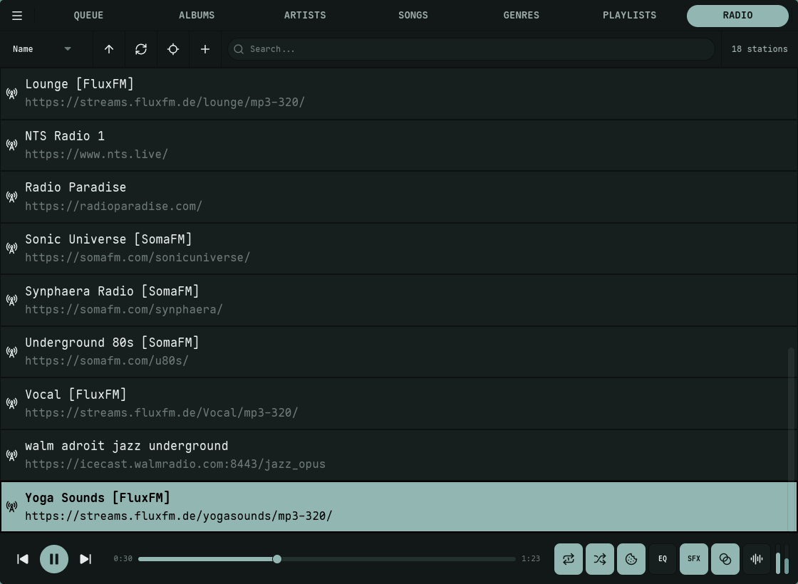
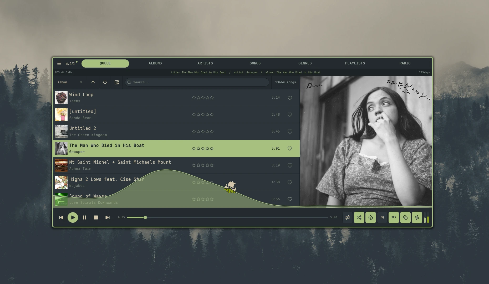

The Albums, Artists, Songs, Genres, Playlists, and Radio views share a common interaction model. This page documents the conventions once so the per-view guides only have to cover what's unique to each.

For an exhaustive list of every shortcut and how to rebind it, see [Keyboard Shortcuts](/reference/hotkeys/).

## Navigation

| Key | Action |
| :-- | :----- |
| `Backspace` | Move the focused row up |
| `Tab` | Move the focused row down |
| `Enter` | Activate the focused item — usually plays it |
| `Ctrl + Enter` | [Shuffle-play](/guides/queue/#shuffle-play) the focused item or selection — a one-shot random order, ignoring the `enter_shuffle` setting |
| `Shift + Enter` | Expand / collapse the focused item *(views that support inline expansion)* |
| `Shift + C` | Center the list on the currently playing track |
| `R` | Refresh the view from the server |

**Center on Playing.** When the playing track is already visible in the current results, `Shift + C` just centers it and leaves your search query alone. When it isn't visible, the search clears and the library pages forward until the track appears, then centers it. There's also a Center on Playing button in the view header — hidden in the [Library Browser](/guides/queue/#library-browser-and-drag-and-drop) side panel (`Ctrl + E`) where the narrower 45% pane reclaims the space for sort, refresh, columns, and search; the keyboard shortcut still works there.

## Inline expansion

`Shift + Enter` (or clicking the count on the focused row, e.g. "*N* songs" / "*N* albums") expands the focused item so its contents render indented below it — albums under an artist, tracks under an album or playlist, albums under a genre. Only one parent can be expanded at a time; changing sort or search collapses it.

Expanded child rows carry a **dotted-decimal sub-index** in the leading column — e.g. `236.1`, `236.2` for the first two children of the parent at row 236, with a slight indent so the parent's own number stays prominent. The **Index** column carries these and is on by default; hide it from the gear icon if you don't want them.

## The slot list

The scrollable list at the center of each library view is a **slot list** — a center-anchored, whole-row viewport in the spirit of [rmpc](https://github.com/mierak/rmpc) and similar terminal music players. The viewport is built from a fixed odd number of equal-height slots (typically 9 — adapting up to 29 on tall windows, down to as few as 1 on short ones), with one designated center slot. Because the viewport is a stack of whole-row containers rather than a pixel-scrolling region, there are no half-cropped items at the top or bottom — only whole rows are ever shown.

Everything *inside* a slot scales with the row height: title, subtitle, and metadata text sizes, album artwork thumbnails, and the star/heart icons (sized to roughly 30% of the row height). The view header above the list and the player bar at the bottom are fixed-height, so as the window grows taller the slots themselves are what stretches — you get more rows *and* each row gets bigger and more readable.

Navigation steps the focused item up or down by one (`Backspace` / `Tab`, or the mouse scroll wheel); there's no page-step key. The "focused" or "centered" row is the one selected for keyboard actions. By default (`stable_viewport = true`), a mouse click highlights the clicked row in place without scrolling — click again on the centered row to play it. Set `stable_viewport = false` in `config.toml` to make a single click center *and* play in one step.

## Player bar

The strip at the bottom of every view is fixed-height and shared across all views: a three-button transport — previous / play-pause / next — on the left, the progress bar in the middle, and mode toggles (repeat, shuffle, consume, equalizer, sound effects, crossfade, bit-perfect, visualizer) plus volume sliders on the right. Stop isn't a transport button; it's on the media keys and `nokkvi stop`. See [Keyboard Shortcuts](/reference/hotkeys/) for the transport key bindings and [Audio](/guides/audio/) for what the mode toggles do.

## Search

`/` focuses the search bar; `Escape` unfocuses it — the query text and filtered results stay. To actually clear a search, use the X button in the search bar, or switch view / change sort.

Search is case-insensitive in every view. The fields each view's search hits vary — see the per-view page when in doubt. Each view searches its own primary field server-side: Albums by album name, Artists by artist name, Songs by track title, Genres by genre name, Playlists by name. The Queue and Radio are the exceptions — they filter client-side: the Queue across title, artist, album, and genre, and Radio across station name and stream URL. So, for example, typing an artist or album name into the Songs view matches song titles only; it won't surface that artist's or album's tracks.

## Sorting

| Key | Action |
| :-- | :----- |
| `Left` | Previous sort mode |
| `Right` | Next sort mode |
| `Page Up` | Toggle ascending / descending |

Each view exposes its own set of sort modes — see the per-view guide. The dynamic column on the right side of the row often adapts to the current sort (e.g. showing release year, play count, or genre).

The sort picker lives in the view header and sizes itself to its widest option — views with short sort lists (Radio's single Name, narrower picker sets) reclaim the spare space for the search field and the item count. The opened dropdown still spans the trigger so every option stays readable.

## Roulette

Every slot-list view's sort dropdown ends with a **Roulette** entry, and `Ctrl + R` triggers the same spin from the keyboard. Picking it sets the list cruising like a slot-machine wheel — the viewport scrolls at a constant rate and keeps cycling indefinitely, with the Tab navigation SFX firing in time with the visible clicks. The wheel runs until you press `Enter`, which rolls the landing item and arms the decel walk: the click cadence audibly slows from cruise speed down to a final ~1 Hz slot-machine click over a few seconds, then the wheel plays whatever it landed on. Pressing Enter is what "throws" the wheel — the landing target isn't committed until that moment.

The decel ends in one of three fake-out shapes, picked randomly per spin: a clean settle (most common, lets the decel curve speak for itself), an overshoot bounce (one keyframe past the target, then back), or a false-settle two-step (a brief pause on target, an overshoot, then the real settle).

What "play" means depends on the view:

- **Genres / Artists** — load every song in the picked entity and start playback at a random song.
- **Queue / Songs / Albums / Playlists / Radio** — use the view's normal play-from-here action on the landing item.

**Cancel** by pressing `Escape` during the spin or switching views — the original viewport is restored and nothing plays. Roulette is disabled inside the [Library Browser](/guides/queue/#library-browser-and-drag-and-drop) side panel because play actions there route to add-to-queue instead.

## Multi-select

| Modifier | Behavior |
| :------- | :------- |
| `Ctrl + Click` | Toggle the clicked row in the selection |
| `Shift + Click` | Range-select from the anchor to the clicked row |
| `Escape` | Clear the selection |

When a selection is active, **Enter** plays everything selected and **Shift + A** queues everything selected. Right-clicking a selected row applies the chosen context-menu action to the whole selection. Changing search, sort, or refreshing usually clears the selection.

### Optional checkbox column

Each list view's columns gear (top-right of the view) has a **Multi-select** toggle that adds a leading checkbox column plus a tri-state header checkbox. The row checkboxes mirror the same selection set as `Ctrl + Click` / `Shift + Click`, and the header toggles between *select all*, *clear*, and *partial* depending on the current state. Available on Albums, Artists, Genres, Playlists, Queue, Songs, and the Similar tab in the Library Browser. Radio doesn't expose it.

## Stars and ratings

Two distinct concepts:

- **Love / star** is a boolean — a track, album, or artist is either favorited or not. Toggle it with `Shift + L`, or click the heart icon in the **Love** column.
- **Rating** is 0–5 stars. Click a star to set it directly; click the same star again to clear. Or use `=` and `-` to step the focused item's rating up or down.

Sorting by **Favorited** puts starred items first; sorting by **Rating** orders by star count. The Rating column auto-shows when you sort by it, even if you've hidden it; the Love column is on by default but only follows its own toggle.

## Click-through expansion

Many views render the artist, album, or genre as clickable text on each row. Clicking those values jumps you to the corresponding view and expands the target inline at the top, so its contents are immediately visible — no follow-up `Shift + Enter` needed. For example, clicking an artist name on a song row takes you to the Artists view with that artist's albums already expanded below the row.

The "*N* songs" / "*N* albums" count cells on Artists and Genres rows are a different click affordance: they jump to a *different view scoped to that entity* (e.g. clicking "391 songs" on a Black Metal row opens the Songs view filtered to that genre's full backing catalog), distinct from the parent-view inline expansion behavior the per-view guides describe.

To return to a normal browse state, collapse the expansion (`Shift + Enter` on the focused row) or change sort.

## Common context menu actions

Most library views share these right-click actions, with the per-view guide listing any extras:

| Action | What it does |
| :----- | :----------- |
| **Add to Queue** | Append the focused item (or selection) to the queue |
| **Add to Playlist** | Open a dialog to append to an existing playlist or create a new one |
| **Get Info** | Open a modal with full metadata. `Shift + I` is the keyboard equivalent |
| **Show in File Manager** | Open the OS file manager at the item's folder |

**Show in File Manager** requires `local_music_path` to be set in your config (the directory where Nokkvi can find your music files locally) — see [Configuration](/reference/config/).

## Columns

Most views expose a gear icon in the header that toggles optional columns (Stars, Plays, Album, Love, etc.). Toggles persist per-view.
