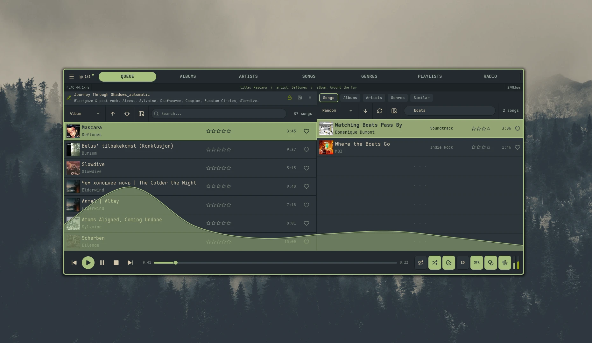

import { Aside } from '@astrojs/starlight/components';

The Playlists view shows every playlist on your Navidrome server. Click a playlist to expand its tracks inline, or right-click for the full set of actions.

For navigation, search, multi-select, ratings, and shared right-click actions, see [Library Basics](/guides/library-basics/). For artwork panel sizing, see [Artwork & Performance](/guides/artwork/#the-artwork-panel).

## Browsing

Playlists are shown with cover art (a 3×3 collage if the playlist spans multiple albums), name, owner, song count, and duration. Search matches playlist name and comment. Private playlists carry a small lock icon next to the name; public ones render without it.

## Sort modes

- **Name** *(default)*, **Song Count**, **Duration**, **Updated At**, **Random**

## Expanding a playlist

`Shift + Enter` expands the focused playlist and loads its tracks inline below it. Only one playlist can be expanded at a time.

## Creating playlists

Three ways:

1. **`+` button — Playlists view header** — opens a Create New Playlist dialog (name + Public toggle). On submit you're dropped straight into split-view edit mode for the new empty playlist; populate it from the Library Browser and save when ready.
2. **Save the queue** — from the Queue view, press `Ctrl + S`. A dialog prompts for a name and lets you create a new playlist or append to an existing one. `Ctrl + S` is not affected by [Quick Add](#quick-add) — it always opens the dialog so you can name or pick a destination.
3. **Add to Playlist** — right-click any track, album, or artist in any view → **Add to Playlist**. The dialog can create a new playlist or pick one to append to. With [Quick Add](#quick-add) on and a [default playlist](#default-playlist) set, the dialog is skipped and the songs append straight to the default.

All three create-playlist dialogs include a **Public** toggle that defaults to on. Public playlists are visible to every Navidrome user; private ones are only visible to you (and admins). You can flip the flag later from the edit bar (see below).

## Default playlist

A "pinned" playlist that [Quick Add](#quick-add) appends to. On its own, marking a default just remembers your choice and lights up the pin chip — it doesn't change any other behavior. Combined with Quick Add, it becomes a one-keystroke append target from any view.

### Setting the default

Four interchangeable entry points:

| Source | How it works |
| :----- | :----------- |
| **Pin chip — Playlists header** | Always visible. Click to open the picker. |
| **Pin chip — Queue header** | Hidden by default. Enable `queue_show_default_playlist` to show it. |
| **Right-click a playlist** | **Set as Default Playlist** — sets directly, no picker. |
| **Settings** | Settings → **Playlists → Default Playlist** opens the picker. |

The chip is a small pin icon — dim when no default is set, lit when one is. Hover for a tooltip showing the current default's name (or *(none) — click to set*).

### The picker

A searchable modal listing every playlist with its artwork, song count, and duration:

- Type to filter; the search input is auto-focused.
- `↑` `↓` to move, `Enter` to select.
- The first entry is always **Clear default** — selecting it removes the current default.
- `Esc`, click outside, or the `×` button dismisses without selecting.

A toast confirms the change in either direction.

### Where it lives

Unlike most preferences, the default playlist is stored in Nokkvi's state database (`~/.local/state/nokkvi/app.redb`), not in `config.toml`. It sits alongside other fast-changing state like volume so switching defaults doesn't rewrite the config file. The two related toggles — `quick_add_to_playlist` and `queue_show_default_playlist` — *are* in `config.toml`.

## Quick add

`quick_add_to_playlist` (Settings → Playlists → **Quick Add to Playlist**) makes the right-click **Add to Playlist** action skip its dialog. With it on and a default set, songs append straight to the default and a toast confirms how many were added. With it off, or with no default configured, the dialog opens as usual.

This is the *only* feature the default playlist enables. Setting a default with Quick Add off is harmless — the chip just remembers your choice for later.

<Aside type="note" title="Quick Add needs both pieces">
  Turning on Quick Add without a default does nothing — the dialog still opens. Set a default first, then enable Quick Add.
</Aside>

To send something to a different playlist for once, toggle Quick Add off, do the add through the dialog, then toggle it back on. The default itself doesn't change.

See [Configuration → Playlists](/reference/config/#playlists) for the underlying TOML keys.

## Editing playlists

Right-click a playlist for the playlist-specific actions:

| Action | What it does |
| :----- | :----------- |
| **Edit Playlist** | Enters split-view edit mode (see below) |
| **Rename Playlist** | Opens a dialog to change the name |
| **Delete Playlist** | Deletes after confirmation |
| **Set as Default Playlist** | Marks as the [default playlist](#default-playlist) target |

Plus the standard **Add to Queue / Add to Playlist / Get Info** actions from [Library Basics](/guides/library-basics/#common-context-menu-actions).

### Split-view edit mode

**Edit Playlist** opens a split layout: the queue (now containing the playlist's tracks) is on the left, and the Library Browser is on the right. From here you can:

- Reorder tracks with drag-and-drop or `Shift + ↑/↓`
- Add tracks by dragging from the Library Browser
- Remove tracks the same way you'd remove them from the queue
- Edit the playlist name and comment inline
- Toggle public/private with the lock button in the edit bar — open lock = public, closed lock = private

When you're done, press `Ctrl + S` to save the changes back to the playlist. Nokkvi tracks unsaved changes and warns before discarding them.

## Limitations

<Aside type="note" title="Server-side features not exposed">
  A few Navidrome playlist features are intentionally not surfaced in Nokkvi.
</Aside>

- **Smart playlists** are not supported — Nokkvi only manages manual playlists.
- **M3U / PLS export** is not supported — playlists live entirely on the server.
