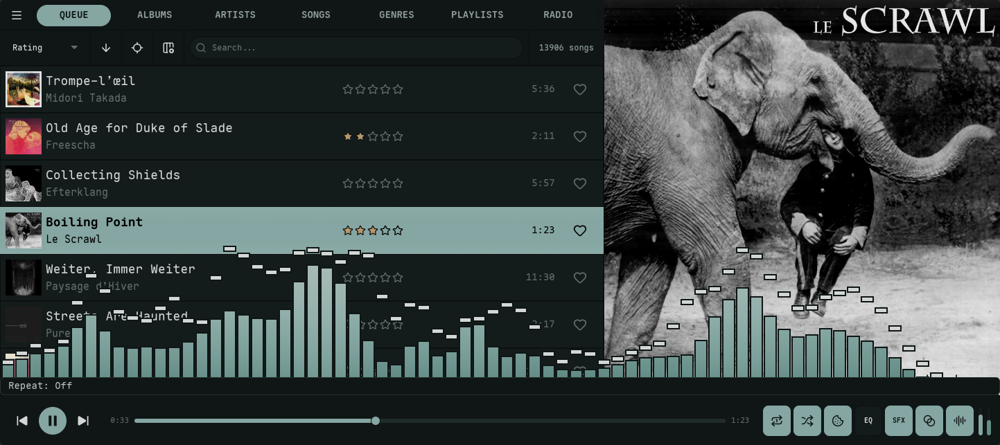
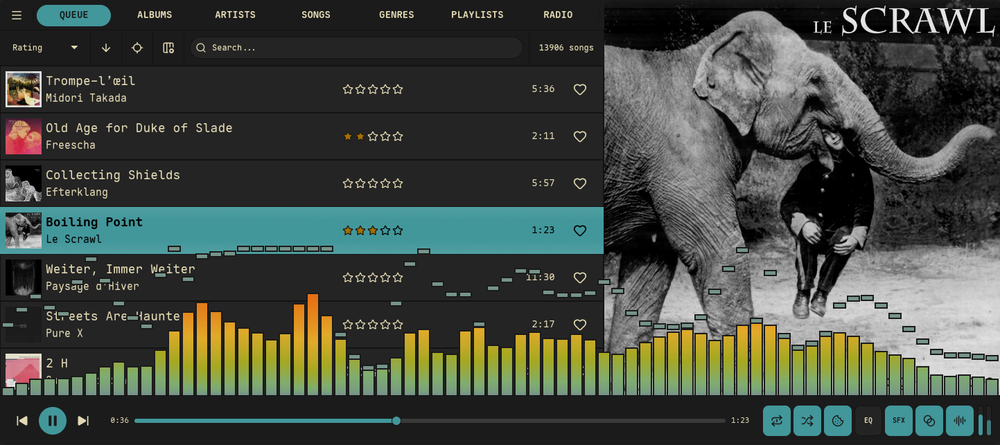
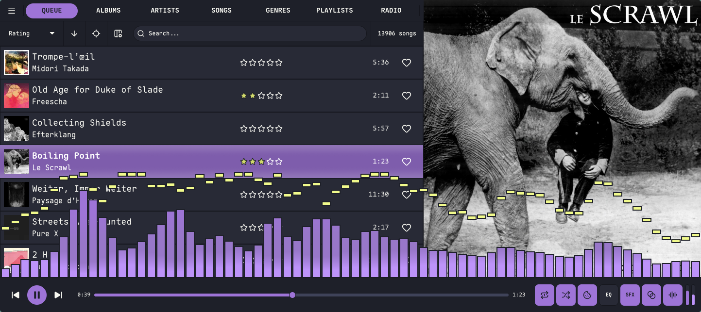
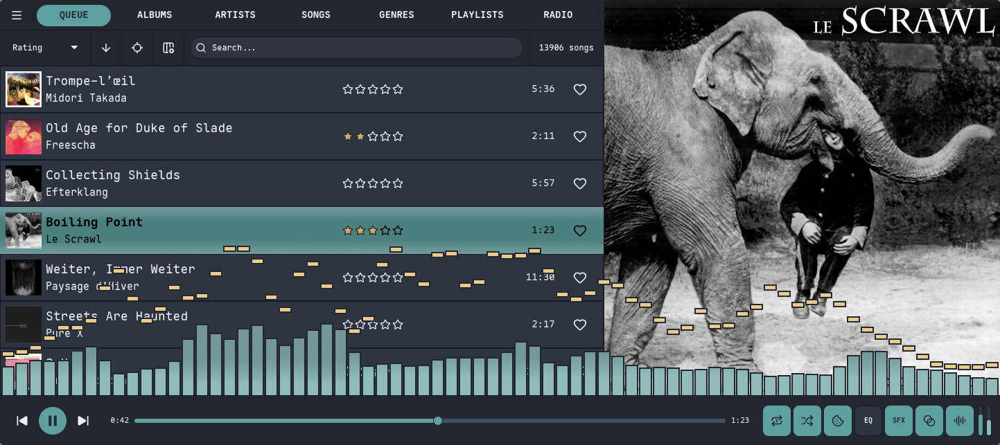
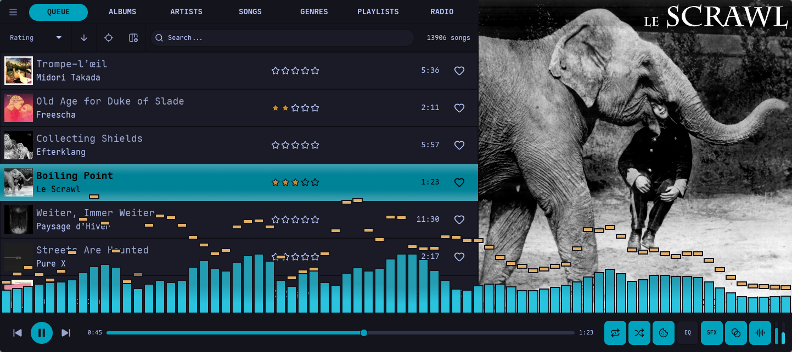
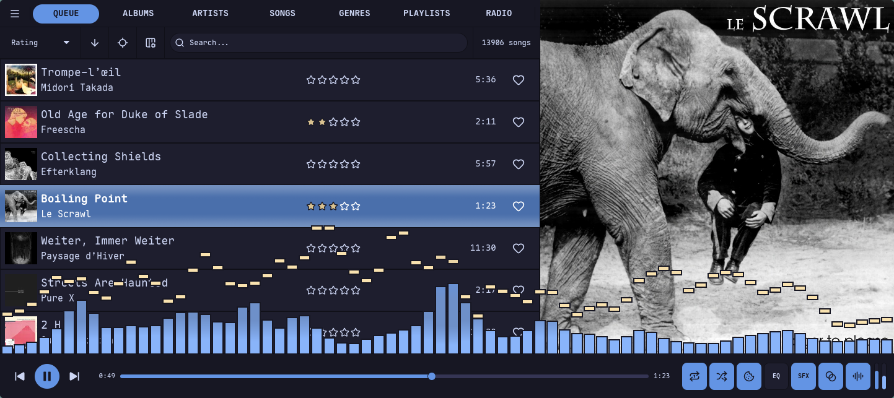
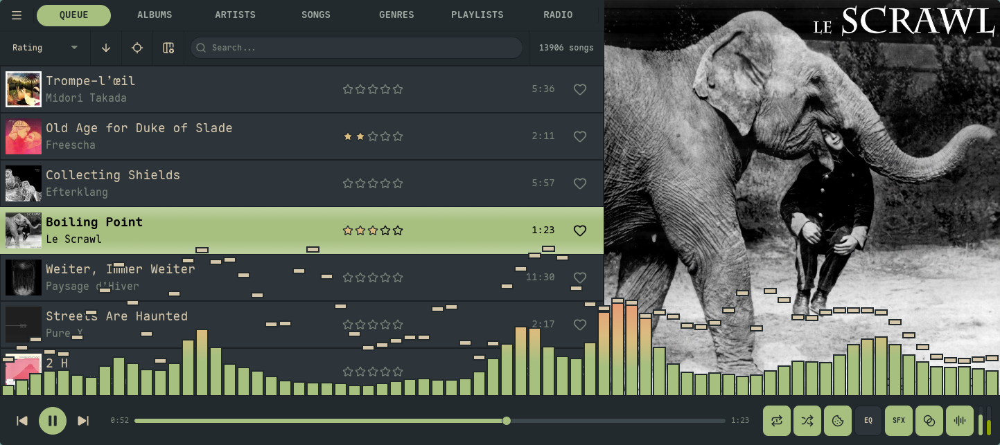
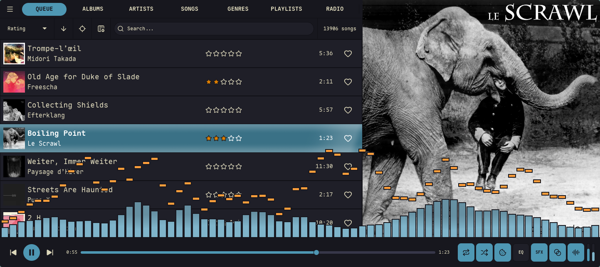

import { Aside, Tabs, TabItem } from '@astrojs/starlight/components';

Nokkvi comes with 23 built-in themes, but you can easily create your own using simple TOML files.

## Built-in themes

Switch themes from **Settings → Theme → Browse Themes…** (open Settings with the `` ` `` backtick). The picker is searchable and paints every row in its own palette, so scrolling the list is a live preview; press Enter or center-click a row to apply it. Here's a sampler of the 23 built-ins — every frame is the same Queue view, so the only thing changing is the theme's background, accent (the focused row + progress bar), text, and visualizer gradient.

<Tabs syncKey="theme">
  <TabItem label="Svalbard">
    
  </TabItem>
  <TabItem label="Gruvbox">
    
  </TabItem>
  <TabItem label="Dracula">
    
  </TabItem>
  <TabItem label="Nord">
    
  </TabItem>
  <TabItem label="Tokyo Night">
    
  </TabItem>
  <TabItem label="Catppuccin">
    
  </TabItem>
  <TabItem label="Everforest">
    
  </TabItem>
  <TabItem label="Kanagawa">
    
  </TabItem>
</Tabs>

## Theme Location

Custom themes are stored in:

```
~/.config/nokkvi/themes/
```

Any `.toml` file placed in this directory will automatically appear in the theme picker (**Settings → Theme → Browse Themes…**). Built-in themes are seeded to this directory on first launch, so you can open any of them as a starting point. Fresh installs start on **Svalbard** (Nokkvi's default theme); switch from the picker at any time.

## Theme File Structure

A theme file has a `name` field and two palette sections — `[dark]` and `[light]` — each containing the same color keys. This lets the same file drive both light and dark mode, toggled by the [`light_mode`](/reference/config/#interface-settings) setting.

```toml
name = "My Theme"

[dark.background]
hard    = "#1d2021"
default = "#282828"
# ...

[dark.foreground]
bright = "#fbf1c7"
# ...

[light.background]
hard    = "#f9f5d7"
default = "#fbf1c7"
# ...
```

All keys have defaults. Both `[dark]` and `[light]` use the same underlying `ThemePalette` struct, and omitted fields fall back to the **dark** defaults — not to the light defaults shown below. So a partial `[light]` section can look surprisingly dark. For a clean light theme, set every light-side key explicitly; the Light columns in the tables below are the recommended values for a complete light palette.

<Aside type="tip">
  Nokkvi watches the `themes/` directory for changes. If you edit the active theme file while the app is open, colors update **instantly** — no restart needed.
</Aside>

---

## Full Palette Reference

All color values are 6-digit hex strings (`"#rrggbb"`).

### `[dark.background]` / `[light.background]`

The background scale runs from darkest (`hard`) to lightest (`level3`). The UI layers components on this scale to create depth.

| Key | Dark default | Light default | Used for |
| :--- | :--- | :--- | :--- |
| `hard` | `#1d1d20` | `#ffffff` | Window chrome, outermost container |
| `default` | `#222226` | `#fafafb` | Main view background |
| `soft` | `#2e2e32` | `#ebebed` | Panel backgrounds, sidebar |
| `level1` | `#2e2e32` | `#ebebed` | Slot row backgrounds |
| `level2` | `#36363a` | `#deddda` | Hovered row, secondary surfaces |
| `level3` | `#3d3846` | `#c0bfbc` | Dividers, input borders |

### `[dark.foreground]` / `[light.foreground]`

The foreground scale runs from brightest text to near-invisible muted text.

| Key | Dark default | Light default | Used for |
| :--- | :--- | :--- | :--- |
| `bright` | `#ffffff` | `#000000` | Primary text, titles |
| `level1` | `#f6f5f4` | `#241f31` | Standard body text |
| `level2` | `#deddda` | `#3d3846` | Secondary text, metadata |
| `level3` | `#c0bfbc` | `#5e5c64` | Tertiary text, timestamps |
| `level4` | `#9a9996` | `#77767b` | Placeholder text, hints |

### `[dark.accent]` / `[light.accent]`

Accent colors drive interactive elements — the progress bar, focused item, playing indicator, and link color.

| Key | Dark default | Light default | Used for |
| :--- | :--- | :--- | :--- |
| `primary` | `#3584e4` | `#3584e4` | Default accent: progress bar, toggles, links |
| `bright` | `#62a0ea` | `#62a0ea` | Hover state, brighter highlight |
| `border_light` | `#1c71d8` | `#99c1f1` | Light border / glow around accent elements |
| `now_playing` | `#3584e4` | `#1c71d8` | Legacy/round-trip-only: parsed but not consumed. The now-playing row fill is derived from `primary` and `bright` with a contrast guard; setting this key has no visible effect. |
| `selected` | `#3584e4` | `#3584e4` | Legacy/round-trip-only: parsed but not consumed. The selected/center slot fill is derived from `bright` with a contrast guard; setting this key has no effect. |

### `border` (top-level scalar)

Unlike the other palette keys, `border` is a single hex string at the **top level** of each palette block — not a sub-table. It sets the color of chrome separators: the 1 px lines between nav-bar cells, list rows, header buttons, modal frames, and capsule outlines.

```toml
[dark]
border = "#151515"

[light]
border = "#c4bc9b"
```

| Key | Dark default | Light default | Used for |
| :--- | :--- | :--- | :--- |
| `border` | derived | derived | Chrome separators throughout the UI. When empty, derives from `background.hard × 0.70`. |

Set `border` as a top-level key under `[dark]` / `[light]` in the theme file (as shown above); omit it to fall back to the derived default.

### `[dark.danger]` / `[light.danger]`

Used for error states, destructive action indicators, and conflict badges.

| Key | Dark default | Light default |
| :--- | :--- | :--- |
| `base` | `#e01b24` | `#c01c28` |
| `bright` | `#f66151` | `#ed333b` |

### `[dark.success]` / `[light.success]`

Used for enabled status indicators and success toasts.

| Key | Dark default | Light default |
| :--- | :--- | :--- |
| `base` | `#33d17a` | `#26a269` |
| `bright` | `#8ff0a4` | `#33d17a` |

### `[dark.warning]` / `[light.warning]`

Used for warning toasts and capture prompts.

| Key | Dark default | Light default |
| :--- | :--- | :--- |
| `base` | `#f6d32d` | `#e5a50a` |
| `bright` | `#f9f06b` | `#f6d32d` |

### `[dark.star]` / `[light.star]`

Used for star rating fills.

| Key | Dark default | Light default |
| :--- | :--- | :--- |
| `base` | `#f6d32d` | `#e5a50a` |
| `bright` | `#f9f06b` | `#f6d32d` |

---

## Visualizer Colors

Each mode (`[dark.visualizer]` / `[light.visualizer]`) has its own set of visualizer colors. See the [Visualizer Reference](/reference/visualizer/) for how `gradient_mode` maps these onto bars and lines.

| Key | Dark default | Light default | Description |
| :--- | :--- | :--- | :--- |
| `border_color` | `#1d1d20` | `#ffffff` | Bar border / LED segment gap color |
| `border_opacity` | `1.0` | `0.0` | Bar border opacity (0.0 to 1.0) |
| `led_border_opacity` | `1.0` | `0.0` | Border opacity in LED bar mode |
| `bar_gradient_colors` | `["#3584e4", "#1c71d8", "#62a0ea"]` | — | 1–8 hex colors used for the bar gradient |
| `peak_gradient_colors` | `["#ed333b", "#ff7800", "#f6d32d"]` | — | 1–8 hex colors used for peak indicators |

```toml
[dark.visualizer]
border_color         = "#1d2021"
border_opacity       = 1.0
led_border_opacity   = 0.8
bar_gradient_colors  = ["#b8bb26", "#98971a", "#d8a657"]
peak_gradient_colors = ["#fb4934", "#fabd2f"]
```

---

## Minimal Example

You don't need to specify every key — omitted fields use the dark defaults shown in the tables above (one exception: `border` derives from `background.hard × 0.70` rather than copying a hex default). Here's a theme that only changes the accent color:

```toml
name = "Cobalt Accent"

[dark.accent]
primary      = "#0088cc"
bright       = "#33aaee"
border_light = "#005f99"

[light.accent]
primary      = "#0077bb"
bright       = "#0088cc"
border_light = "#005f99"
```

## Full Example

A complete theme file with all sections filled out:

```toml
name = "Example Theme"

[dark]
border = "#151515"

[dark.background]
hard    = "#1d2021"
default = "#282828"
soft    = "#32302f"
level1  = "#3c3836"
level2  = "#504945"
level3  = "#665c54"

[dark.foreground]
bright = "#fbf1c7"
level1 = "#ebdbb2"
level2 = "#d5c4a1"
level3 = "#bdae93"
level4 = "#a89984"

[dark.accent]
primary      = "#458588"
bright       = "#83a598"
border_light = "#689d6a"

[dark.danger]
base   = "#cc241d"
bright = "#fb4934"

[dark.success]
base   = "#98971a"
bright = "#b8bb26"

[dark.warning]
base   = "#d79921"
bright = "#fabd2f"

[dark.star]
base   = "#d79921"
bright = "#fabd2f"

[dark.visualizer]
border_color        = "#1d2021"
border_opacity      = 1.0
led_border_opacity  = 0.8
bar_gradient_colors = ["#b8bb26", "#fabd2f", "#83a598"]
peak_gradient_colors = ["#fb4934", "#fabd2f"]

[light]
border = "#c4bc9b"

[light.background]
hard    = "#f9f5d7"
default = "#fbf1c7"
soft    = "#f2e5bc"
level1  = "#ebdbb2"
level2  = "#d5c4a1"
level3  = "#bdae93"

[light.foreground]
bright = "#282828"
level1 = "#3c3836"
level2 = "#504945"
level3 = "#665c54"
level4 = "#7c6f64"

[light.accent]
primary      = "#076678"
bright       = "#458588"
border_light = "#83a598"

[light.danger]
base   = "#9d0006"
bright = "#cc241d"

[light.success]
base   = "#79740e"
bright = "#98971a"

[light.warning]
base   = "#b57614"
bright = "#d79921"

[light.star]
base   = "#b57614"
bright = "#d79921"

[light.visualizer]
border_color        = "#fbf1c7"
border_opacity      = 0.0
led_border_opacity  = 0.0
bar_gradient_colors = ["#458588", "#076678", "#83a598"]
peak_gradient_colors = ["#cc241d", "#d79921"]
```
