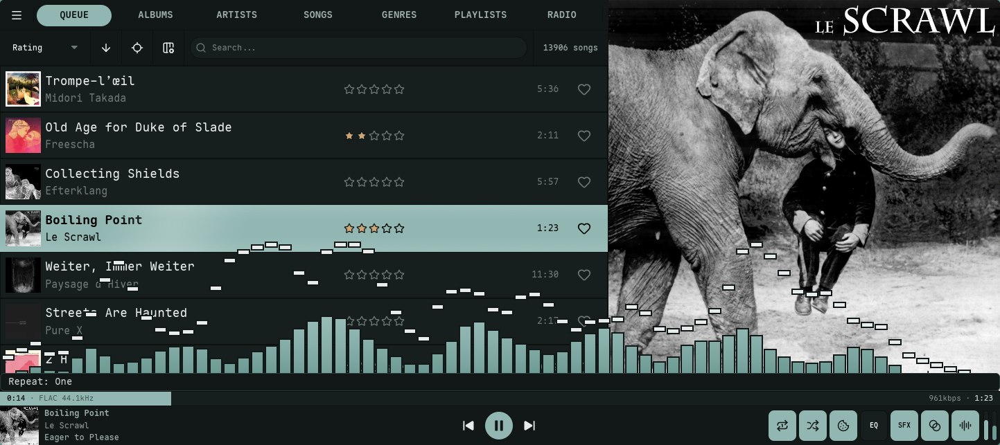
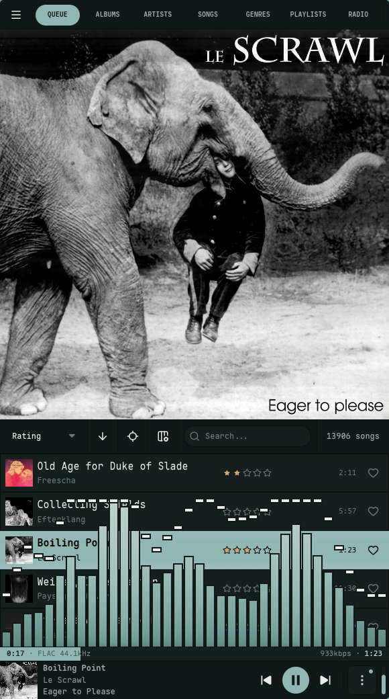
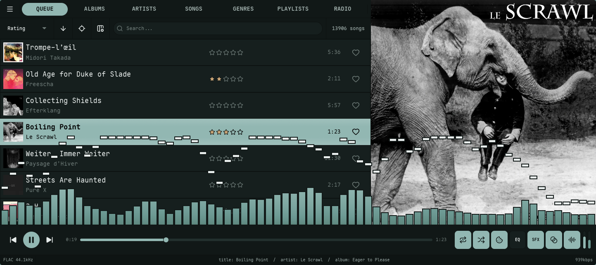
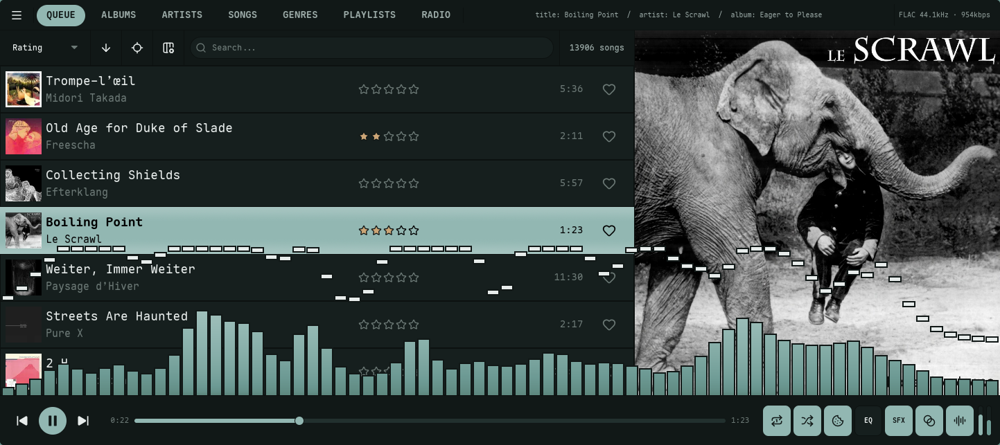
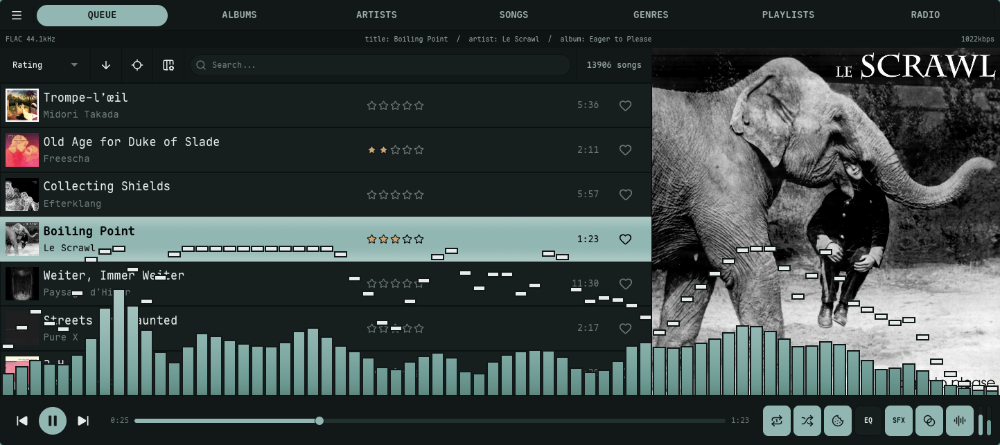
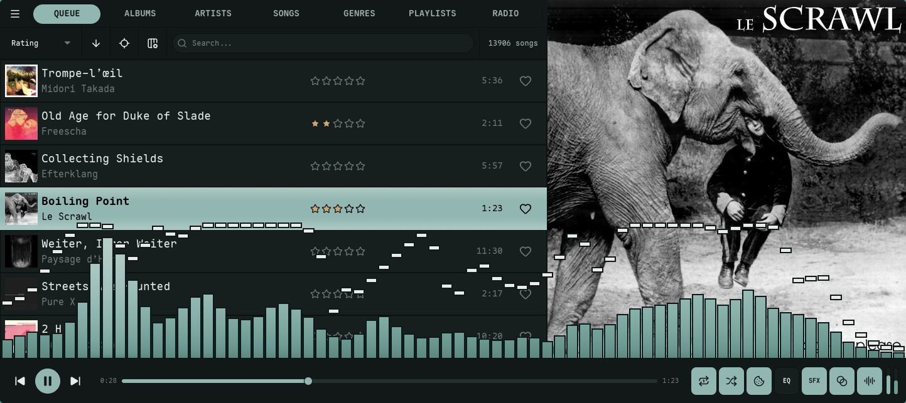
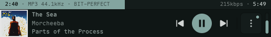

import { Tabs, TabItem } from '@astrojs/starlight/components';

The now-playing **metadata strip** — title, artist, album, and the track's format — can sit in a few different places, set by [`track_info_display`](/reference/config/#interface-settings). Default is `mini_player`; the others drop it as a strip in the bottom player bar, tuck it into the chrome, or hide it to give the list and artwork the whole window.

<Tabs syncKey="track-info-display">
  <TabItem label="Mini Player">
    Artwork, metadata, and transport merge into one bar topped by a full-width progress scrub that shows elapsed and total time alongside the track's format and bitrate. On a wide window it spreads into three sections — metadata on the left, transport centered, modes and volume on the right. As the window narrows it folds into a single compact cluster with the mode toggles tucked behind a kebab (⋮) menu.

    

    

    Hide the volume slider or the mode toggles independently with [`mini_player_show_volume`](/reference/config/#interface-settings) and [`mini_player_show_modes`](/reference/config/#interface-settings).
  </TabItem>
  <TabItem label="Player Bar">
    The metadata sits as a strip in the bottom player bar, just below the transport row.

    
  </TabItem>
  <TabItem label="Top Bar">
    The metadata rides inline in the top navigation row, to the right of the view tabs. In side-nav or no-nav layouts it sits as its own row above the slot list instead.

    
  </TabItem>
  <TabItem label="Top Bar Under">
    The metadata gets its own full-width row directly beneath the top navigation bar.

    
  </TabItem>
  <TabItem label="Off">
    No metadata strip — the list and artwork get the full window.

    
  </TabItem>
</Tabs>

Which fields the strip shows, and whether they carry `title:` / `artist:` / `album:` labels, is controlled by the `strip_show_*` keys in the [configuration reference](/reference/config/#interface-settings).

## Bit-Perfect Status Badge

When [bit-perfect output](/guides/audio/#bit-perfect-output) is engaged, the now-playing strip carries a small badge reporting the *real* state of your sound card's clock — read from `/proc/asound`, not the rate nokkvi requested. It shows only while bit-perfect output is in Strict or Relaxed mode and a local track is playing; radio is excluded, since a network stream can't be bit-perfect.

| Badge | Meaning |
| :--- | :--- |
| `BIT-PERFECT` | The device is clocked at the track's sample rate. Audio is reaching the DAC untouched — no resampling, no DSP. |
| `RESAMPLED→96k` | The device is locked at a different rate (shown in kHz — e.g. `→96k`), so PipeWire is resampling. When it can, the badge appends the app holding the device at that rate (`RESAMPLED→96k · Zen`), so you know what to close. |
| `UNVERIFIED` | Nokkvi can't read the device clock. Usually a Bluetooth sink (which re-encodes the audio, so bit-perfect isn't possible) or an idle / suspended device. |

A brief blank moment right as a track starts is normal — nokkvi waits for the device to settle before committing to a state, so it won't flash a false `UNVERIFIED`. In **Relaxed** mode the badge also drops for the duration of a same-rate crossfade — the overlapping blend isn't bit-perfect — and returns once the next track settles.
