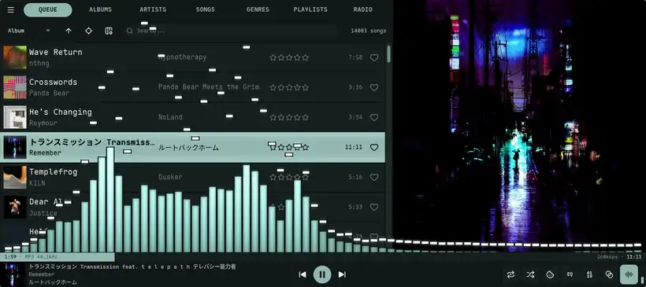
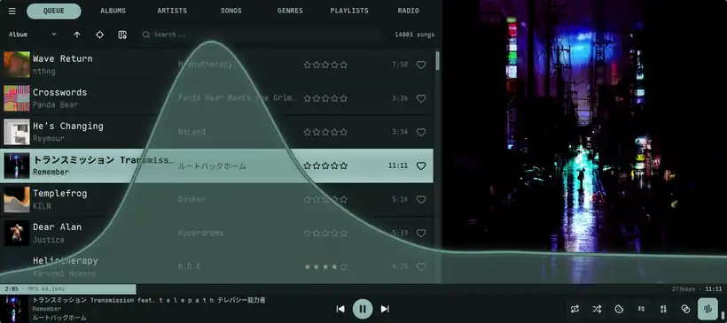
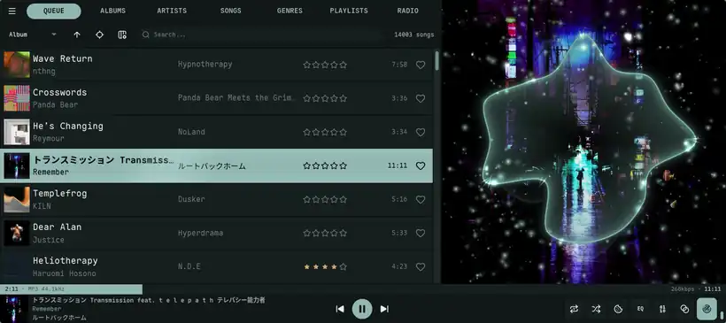
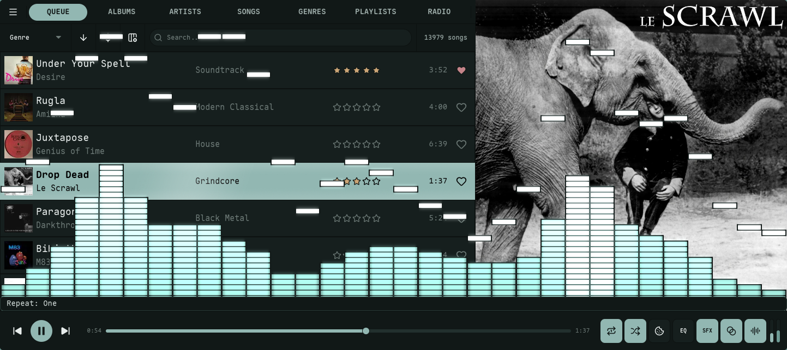
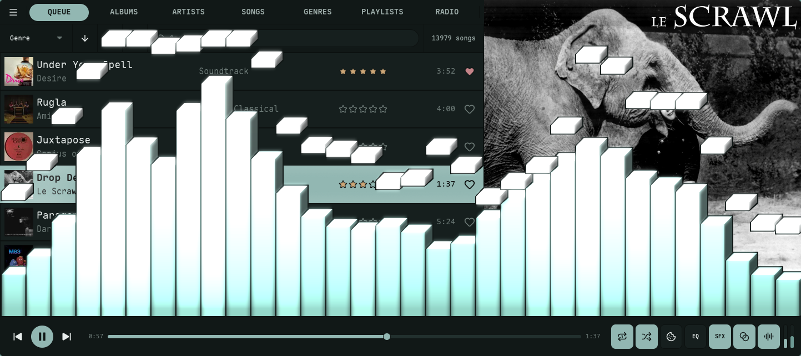
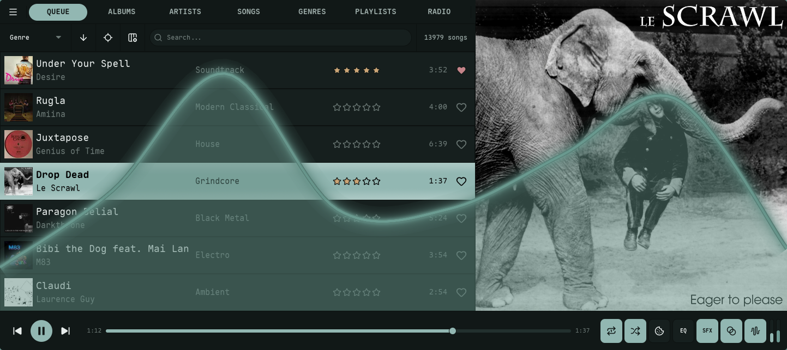
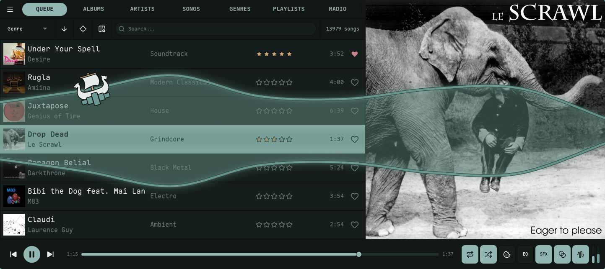
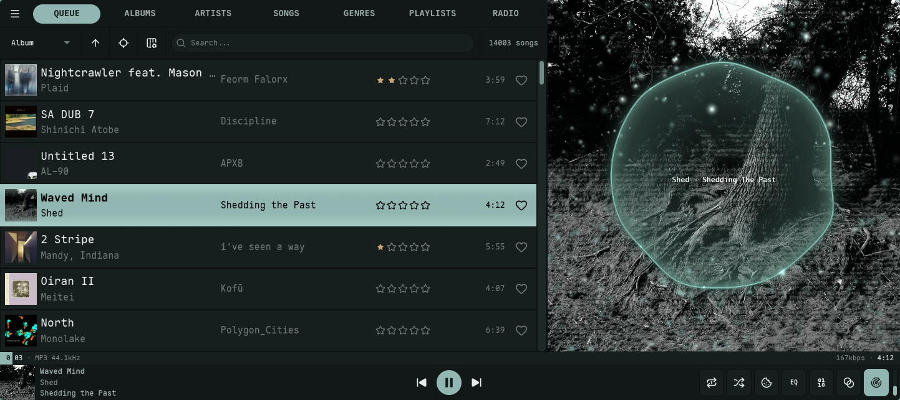
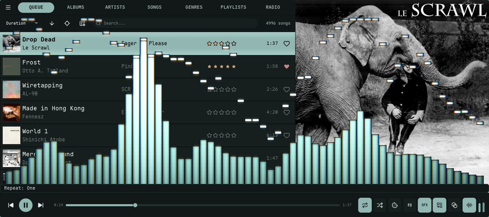

import { Tabs, TabItem, Card, CardGrid, Aside } from '@astrojs/starlight/components';

Nokkvi features a custom-built, GPU-accelerated visualizer that runs an internal FFT over Nokkvi's own audio output and renders it with WGSL shaders. This reference explains the modes, effects, and color-mapping strategies available in `config.toml`.

<Tabs syncKey="visualizer-mode">
  <TabItem label="Bars">
    Frequency data rendered as vertical columns with optional peak indicators.

    
  </TabItem>
  <TabItem label="Lines">
    Frequency data rendered as a continuous path, oscilloscope-style. The surfing boat overlay is optional.

    
  </TabItem>
  <TabItem label="Scope">
    A circular oscilloscope (time-domain waveform ring) drawn over the now-playing cover art, with an optional glowing particle field.

    
  </TabItem>
</Tabs>

## Bars Mode

The `bars` mode renders frequency data as vertical columns. It is highly configurable with various gradient and peak behaviors.

### Gradient Modes
Controls how colors from your theme's palette are mapped onto the bars.

| Mode | Description |
| :--- | :--- |
| `static` | **Static Height.** The gradient is pinned to the visualizer; bars reveal higher colors as they rise. |
| `wave` *(default)* | **Stretched Gradient.** Each bar's gradient is stretched by its amplitude, redistributing the palette as the bar rises and falls. |

### Orientation
Determines the axis along which gradient colors are applied.

- **`vertical`**: Colors map from the bottom of the visualizer to the top.
- **`horizontal`**: Colors map from the low frequencies (left) to high frequencies (right).

<Aside type="note">
  Orientation applies to both gradient modes (`static` and `wave`).
</Aside>

### Peak Behavior
Peaks are small indicators that mark the highest point reached by a bar.

| Mode | Description |
| :--- | :--- |
| `none` | Peaks are disabled. |
| `fade` | Peaks hold for a duration, then fade out in their current position. |
| `fall` | Peaks hold, then drop at a constant velocity. |
| `fall_accel` | Peaks hold, then fall with simulated gravity (acceleration). |
| `fall_fade` | Peaks fall at a constant velocity while simultaneously fading out. |

### Peak Gradient Modes
Controls the coloring of the peak indicators.

- **`static`**: Uses only the first color defined in `peak_gradient_colors`.
- **`cycle`**: Smoothly cycles through all peak colors over time (breathing effect).
- **`height`**: Color is determined by the peak's vertical position.
- **`match`**: The peak always matches the color of the bar at that specific height.

### Peak Flash
[`visualizer.bars.flash_intensity`](/reference/config/#bars-mode) (default `0.6`, range `0.0`–`1.0`; `0` disables). When a bar spikes on a transient or beat, its body blooms toward the first peak color. The flash spreads to a few neighbouring bars and decays. This is separate from the peak indicator and from the global [Bloom Glow](#bloom-glow).

### LED Mode
[`visualizer.bars.led_bars`](/reference/config/#bars-mode) (default `false`) renders each bar as a stack of LED/VU-meter segments. [`led_segment_height`](/reference/config/#bars-mode) sets the segment height, and `border_width` doubles as the gap between segments. In LED mode the peak indicator is exactly one segment tall, so `peak_height_ratio` is ignored.

### Isometric Depth
[`visualizer.bars.bar_depth_3d`](/reference/config/#bars-mode) (default `0`, off) extrudes each bar with shaded top and side faces for an isometric 3D look. Higher values deepen the extrusion (up to 20 px).

---

## Lines Mode

The `lines` mode renders frequency data as a continuous path (oscilloscope style).

### Style
- **`smooth`**: Uses Catmull-Rom spline interpolation for a liquid, organic look.
- **`angular`**: Uses direct point-to-point lines for a sharper, technical look.

### Gradient Modes
| Mode | Description |
| :--- | :--- |
| `breathing` | The entire line cycles through the palette over time. |
| `static` *(default)* | The line stays a single solid color (the first in the palette). |
| `position` | Colors are mapped from left (bass) to right (treble). |
| `height` | Colors are mapped based on amplitude (quiet = bottom colors, loud = top colors). |
| `gradient` | A blend of horizontal position and amplitude — peaks shift the palette further along, mixing the position and height mappings 50/50. |

### Glow
[`visualizer.lines.glow_intensity`](/reference/config/#lines-mode) (default `0.5`, range `0.0`–`1.0`). A neon emissive halo drawn beyond the main stroke — over the dark backdrop it reads as a tube of light. The halo widens (≈3–10 px) with intensity, brightens with overall loudness, and flares on each beat. The dark outline never glows, so it stays crisp. `0` disables it.

### Fill & Mirror
- **Fill.** [`visualizer.lines.fill_opacity`](/reference/config/#lines-mode) (default `0.5`) shades the area under the curve with the gradient.
- **Mirror.** [`visualizer.lines.mirror`](/reference/config/#lines-mode) (default `false`) draws the waveform symmetrically from the centre, oscilloscope-style.

### Surfing Boat

On by default for `lines` mode: a small boat rides the waveform. Set [`visualizer.lines.boat = false`](/reference/config/#lines-mode) in `config.toml`, or toggle it under **Settings → Visualizer → Lines**, to turn it off.

- **Cruise speed** is driven by tagged BPM, onset energy, a slow energy envelope, and spectral presence. Top speed scales with the full energy stack, so denser tracks read faster; silence brings the boat to rest.
- **Rowing.** A beat-locked half-sine envelope adds gentle thrust pulses when BPM is tagged.
- **Tacks** ramp sail thrust from zero back to full over 4 seconds.
- **Slope** tilts the boat to match the local wave (spring-damped, capped near 17°). Slope force only resists motion, never assists.
- **Heading.** The sprite mirrors horizontally so the sail catches wind from behind.
- **Edge wrap** preserves momentum; the boat sails fully off one edge (through an off-screen margin) before reappearing on the opposite side — it is drawn as a single sprite, never split across the seam.
- **Anchor.** Every 45–120 s the boat anchors for 10–15 s, dropping a lucide-anchor icon to the visualizer floor with a curved rope back to the boat. The rope sways with the local wave; tacks pause for the duration.
- **Sizing.** Boat sprite clamps to 48–160 px; rope stroke 1.5–3.5 px; the anchor scales with the boat.
- **Outline.** The boat hull, anchor, and rope all use the theme's dark-variant `border_color` / `border_opacity`, so they stay solid in light mode even when the wave's own outline fades. The boat outline is independent of the wave's `outline_thickness` / `outline_opacity`; only a `border_opacity` of `0` hides it.
- **Pause vs silence.** Freezes when audio is paused; sinks to the floor during silence while playing.

The same boat also sails the [Harbour](/guides/harbour/#the-artwork-preview) Trawl panel, where it behaves differently: it drags its anchor continuously (that's the *trawling*) and cruises on a fixed gentle breeze rather than the audio — so none of the periodic anchoring, rowing, or tacking above applies, and it keeps moving with nothing playing.

---

## Scope Mode

The `scope` mode draws a circular oscilloscope — a time-domain waveform ring — over the now-playing cover art. It is cycled after Lines with the `V` hotkey, or set [`visualization_mode = "scope"`](/reference/config/#playback-settings). The ring reuses the Lines [gradient modes](#gradient-modes-1) and [style](#style) options, and adds geometry and particle controls of its own.

### Ring Geometry
- **Radius.** [`visualizer.scope.radius`](/reference/config/#scope-mode) (default `0.7`) sets the ring's mean radius as a fraction of the space inside the cover — `0.1` is a tiny inner ring, `0.95` nearly fills the panel.
- **Sensitivity.** [`visualizer.scope.sensitivity`](/reference/config/#scope-mode) (default `1.5`) is the waveform swing: how far loud audio pushes the ring in and out (`0.5` subtle, `5.0` wild).
- **Point count.** [`visualizer.scope.point_count`](/reference/config/#scope-mode) (default `16`) sets how many points trace the ring — low values give a chunky, blobby ring; high values resolve fine waveform detail.
- **Thickness.** [`visualizer.scope.line_thickness`](/reference/config/#scope-mode) (default `0.01`) is the ring stroke as a fraction of the panel.

### Ring Look
- **Fill.** [`visualizer.scope.fill_opacity`](/reference/config/#scope-mode) (default `0.5`) shades a radial gradient from the ring toward the centre.
- **Glow.** [`visualizer.scope.glow_intensity`](/reference/config/#scope-mode) (default `0.35`) wraps the ring in a neon halo, like the Lines glow.
- **Beam.** [`visualizer.scope.beam`](/reference/config/#scope-mode) (default `true`) renders the ring with additive blending so overlapping glow accumulates into a bright neon beam (woscope-style).
- **Outline.** [`visualizer.scope.outline_thickness`](/reference/config/#scope-mode) / [`outline_opacity`](/reference/config/#scope-mode) (default off) draw a darker border behind the ring for contrast on busy covers.

### Particles
[`visualizer.scope.particles`](/reference/config/#scope-mode) (default `true`) launches a glowing particle field that drifts outward from the ring on the beat — the NCS / Wav2Bar look. [`particle_count`](/reference/config/#scope-mode) (default `192`, up to `2048`) sets how many, and [`particle_speed`](/reference/config/#scope-mode) (default `0.5`) how fast they fly out (`0.1` lazy drift, `4.0` energetic).

---

## Placement

Bars and Lines can be drawn in one of two places, set per mode via [`visualizer.bars.placement`](/reference/config/#bars-mode) and [`visualizer.lines.placement`](/reference/config/#lines-mode):

- **`over_cover`** *(default)* — over the now-playing cover art in the Queue view, and only while audio is playing. The integrated cover look greets you on the default Queue view.
- **`bottom_band`** — the classic placement: a band across the bottom of the window, above the player bar, visible on every view.

Scope has no placement setting of its own — it is always drawn over the cover.

---

## Effects

These effects apply on top of whichever mode (bars, lines, or scope) is active, and live under **Settings → Visualizer → Frame**. Bloom, Beat Reactivity, and CRT are global; Motion Trails and Echo are configured per mode.

### Bloom Glow
[`visualizer.bloom`](/reference/config/#general-visualizer) (default `true`) makes bright bars, peak flashes, and the neon line core bleed a soft additive halo. A brightness threshold means only the bright parts glow. [`visualizer.bloom_intensity`](/reference/config/#general-visualizer) (default `0.6`, range `0.0`–`1.0`) sets the strength — at `0` nothing glows even with bloom enabled.

### Beat Reactivity
[`visualizer.beat_reactivity`](/reference/config/#general-visualizer) (default `1.0`, range `0.0`–`1.0`) controls how hard the effects pump on the beat and bass drops. It scales the bloom surge, the lines-mode glow flare, the bar brightness lift, and the echo swirl together. At `0.0` everything is steady and tracks loudness only; at `1.0` it punches on every kick. (The CRT beat zoom-punch is driven by the raw beat and is not affected by this setting.)

### Motion Trails
Motion trails leave a fading after-image behind the waveform — a short ghost at low values, a long comet trail near `1.0`. It is a flat per-frame fade; for the swirling variant use [Echo](#echo). Configured per mode — [`visualizer.bars.trails`](/reference/config/#bars-mode), [`visualizer.lines.trails`](/reference/config/#lines-mode), [`visualizer.scope.trails`](/reference/config/#scope-mode) — and off (`0.0`) by default everywhere because it noticeably changes the look.

### Echo
Echo is Milkdrop-style zoom/rotate feedback: the visualizer spirals and tunnels into itself, swirling harder with the bass and beat. Near `1.0` the feedback persists strongly and effectively takes over the display. Unlike [Motion Trails](#motion-trails) (a flat fade), Echo warps and rotates each fading copy. Configured per mode — [`visualizer.bars.echo`](/reference/config/#bars-mode), [`visualizer.lines.echo`](/reference/config/#lines-mode), [`visualizer.scope.echo`](/reference/config/#scope-mode). Bars and Lines default to `0.0` (off); Scope defaults to `1.0`, a strong feedback swirl that takes over the ring.

### CRT / Film
[`visualizer.crt`](/reference/config/#general-visualizer) (default `0.0`, off) is a retro composite under one master amount: chromatic aberration, scanlines, vignette, film grain, and a beat zoom-punch. It is masked to the visualizer content, so it never tints the rest of the UI.

---

## Advanced Smoothing

Nokkvi provides two mutually exclusive smoothing algorithms to tailor the visualizer's response. Both apply to **bars mode only** — lines mode does its own Catmull-Rom smoothing on the GPU.

### Monstercat Smoothing
An exponential falloff effect that spreads energy to neighboring bars, creating a "bouncy" and connected look.
- **Key**: [`visualizer.monstercat`](/reference/config/#general-visualizer)
- **Value**: `0.7` to `10.0` (higher = more spread). Values below `0.7` snap to `0.0` (disabled).

### Waves Smoothing
Applies spline interpolation between bars to create a smooth, wave-like silhouette.
- **Key**: [`visualizer.waves`](/reference/config/#general-visualizer)
- **Value**: `true` / `false`.
- **Intensity**: [`visualizer.waves_smoothing`](/reference/config/#general-visualizer) (`2` to `16`).
