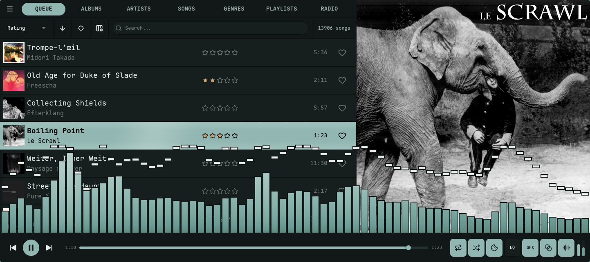
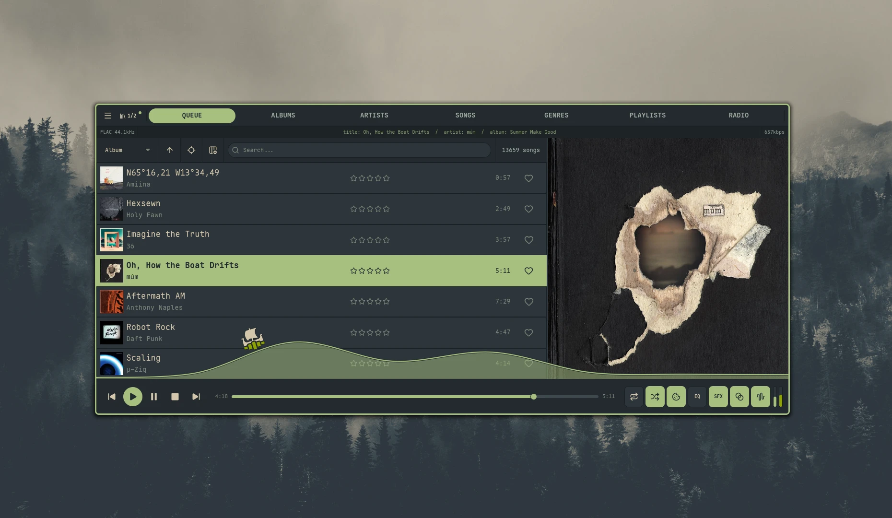

import { Tabs, TabItem, Card, CardGrid, Aside } from '@astrojs/starlight/components';

Nokkvi features a custom-built, hardware-accelerated visualizer powered by PipeWire and WGSL shaders. This reference explains the various modes and color mapping strategies available in `config.toml`.

<Tabs syncKey="visualizer-mode">
  <TabItem label="Bars">
    Frequency data rendered as vertical columns with optional peak indicators.

    
  </TabItem>
  <TabItem label="Lines">
    Frequency data rendered as a continuous path, oscilloscope-style. The surfing boat overlay is optional.

    
  </TabItem>
</Tabs>

## Bars Mode

The `bars` mode renders frequency data as vertical columns. It is highly configurable with various gradient and peak behaviors.

### Gradient Modes
Controls how colors from your theme's palette are mapped onto the bars.

| Mode | Description |
| :--- | :--- |
| `static` | **Static Height.** The gradient is fixed to the background. Bars "reveal" higher colors as they rise. |
| `wave` | **Stretched Gradient.** The full gradient is compressed/stretched to fit the current height of each bar. |
| `shimmer` | **Animated Solid.** Each bar is a single color, but the entire visualizer cycles through colors over time and music energy. |
| `energy` | **Loudness Offset.** The gradient position shifts rapidly based on the instantaneous volume of the track. |
| `alternate` | **Two-Tone.** Bars oscillate between the first two colors of the palette in a rhythmic pattern. |

### Orientation
Determines the axis along which gradient colors are applied.

- **`vertical`**: Colors map from the bottom of the visualizer to the top.
- **`horizontal`**: Colors map from the low frequencies (left) to high frequencies (right).

<Aside type="note">
  Orientation works with `static`, `wave`, `shimmer`, and `energy` modes. It is ignored by `alternate`.
</Aside>

### Peak Behavior
Peaks are small indicators that mark the highest point reached by a bar.

| Mode | Description |
| :--- | :--- |
| `none` | Peaks are disabled. |
| `fade` | Peaks hold for a duration, then fade out in their current position. |
| `fall` | Peaks hold, then drop at a constant velocity. |
| `fall_accel` | Peaks hold, then fall with simulated gravity (acceleration). |
| `fall_fade` | Peaks fall at a constant velocity while simultaneously fading out. |

### Peak Gradient Modes
Controls the coloring of the peak indicators.

- **`static`**: Uses only the first color defined in `peak_gradient_colors`.
- **`cycle`**: Smoothly cycles through all peak colors over time (breathing effect).
- **`height`**: Color is determined by the peak's vertical position.
- **`match`**: The peak always matches the color of the bar at that specific height.

---

## Lines Mode

The `lines` mode renders frequency data as a continuous path (oscilloscope style).

### Style
- **`smooth`**: Uses Catmull-Rom spline interpolation for a liquid, organic look.
- **`angular`**: Uses direct point-to-point lines for a sharper, technical look.

### Gradient Modes
| Mode | Description |
| :--- | :--- |
| `breathing` | The entire line cycles through the palette over time. |
| `static` | The line stays a single solid color (the first in the palette). |
| `position` | Colors are mapped from left (bass) to right (treble). |
| `height` | Colors are mapped based on amplitude (quiet = bottom colors, loud = top colors). |
| `gradient` | A vertical gradient is applied to the line path. |

### Surfing Boat

Optional overlay for `lines` mode: a small boat rides the waveform. Toggle under **Settings → Visualizer → Lines** or set [`visualizer.lines.boat = true`](/reference/config/#lines-mode) in `config.toml`.

- **Cruise speed** is driven by tagged BPM, onset energy, a slow energy envelope, and spectral presence. Top speed scales with the full energy stack, so denser tracks read faster; silence brings the boat to rest.
- **Rowing.** A beat-locked half-sine envelope adds gentle thrust pulses when BPM is tagged.
- **Tacks** ramp sail thrust from zero back to full over 4 seconds.
- **Slope** tilts the boat to match the local wave (spring-damped, capped near 17°). Slope force only resists motion, never assists.
- **Heading.** The sprite mirrors horizontally so the sail catches wind from behind.
- **Edge wrap** preserves momentum; the boat draws split across the seam.
- **Anchor.** Every 45–120 s the boat anchors for 10–15 s, dropping a lucide-anchor icon to the visualizer floor with a curved theme-colored rope back to the boat. The rope sways with the local wave; tacks pause for the duration.
- **Sizing.** Boat sprite clamps to 48–160 px; rope stroke 1.5–3.5 px; the anchor scales with the boat.
- **Outline** tracks the lines-mode wave outline (`border_color` / `border_opacity`) and hides when the wave outline is hidden.
- **Pause vs silence.** Freezes when audio is paused; sinks to the floor during silence while playing.

---

## Advanced Smoothing

Nokkvi provides two mutually exclusive smoothing algorithms to tailor the visualizer's response.

### Monstercat Smoothing
An exponential falloff effect that spreads energy to neighboring bars, creating a "bouncy" and connected look.
- **Key**: [`visualizer.monstercat`](/reference/config/#general-visualizer)
- **Value**: `0.7` to `1.0` (higher = more spread). Values below `0.7` snap to `0.0` (disabled).

### Waves Smoothing
Applies spline interpolation between bars to create a smooth, wave-like silhouette.
- **Key**: [`visualizer.waves`](/reference/config/#general-visualizer)
- **Value**: `true` / `false`.
- **Intensity**: [`visualizer.waves_smoothing`](/reference/config/#general-visualizer) (`2` to `16`).
